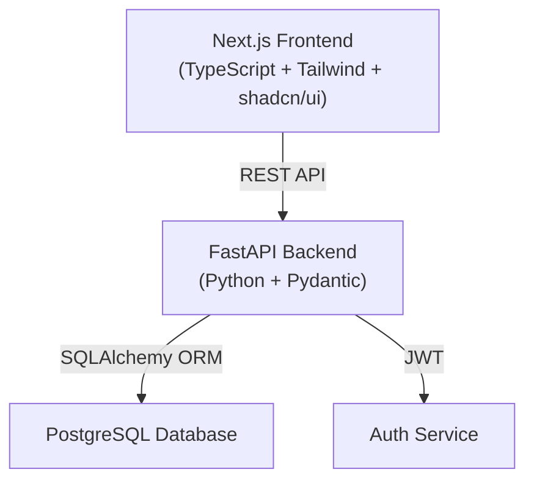

# AyurCTMS — Implementation Plan

> **Ayurveda Clinical Trial Management System**
> Full-stack MVP: Next.js + FastAPI + PostgreSQL

---

## Goal

Build a production-quality hackathon MVP that enables clinical researchers, ethics committees, pharmacovigilance teams, and regulators to manage Ayurveda clinical trials from a single platform. The system must support the complete demo scenario (login → dashboard → trial → AE reporting → audit → compliance → exports) in 3–5 minutes.

---

## Architecture



---

## Proposed Changes

### Phase 1 — Backend Foundation (Priority 1)

---

#### [NEW] `backend/` — FastAPI Application

| File | Purpose |
|------|---------|
| `backend/app/main.py` | FastAPI app entry, CORS, middleware |
| `backend/app/config.py` | Settings via Pydantic BaseSettings + .env |
| `backend/app/database.py` | SQLAlchemy engine, session, Base |
| `backend/requirements.txt` | Python dependencies |
| `backend/.env.example` | Template for secrets |

#### [NEW] `backend/app/models/` — SQLAlchemy Models

| File | Tables |
|------|--------|
| `user.py` | `users` |
| `trial.py` | `trials` |
| `site.py` | `sites` |
| `participant.py` | `participants` |
| `adverse_event.py` | `adverse_events` |
| `ethics_review.py` | `ethics_reviews` |
| `document.py` | `documents` |
| `audit_log.py` | `audit_logs` |
| `notification.py` | `notifications` |

All tables use UUID primary keys (except `audit_logs` which uses BIGSERIAL). Relationships defined via SQLAlchemy `relationship()`.

#### [NEW] `backend/app/schemas/` — Pydantic Schemas

Request/response models for every entity, with validation. Separate `Create`, `Update`, and `Response` schemas per entity.

#### [NEW] `backend/app/auth/` — Authentication & Authorization

| File | Purpose |
|------|---------|
| `auth.py` | JWT creation/validation, password hashing (bcrypt) |
| `dependencies.py` | `get_current_user`, `require_role()` FastAPI dependencies |
| `router.py` | `POST /auth/login`, `POST /auth/register` |

**Roles**: `PI`, `ETHICS`, `PV`, `REGULATOR`, `ADMIN` — enforced server-side via dependency injection.

#### [NEW] `backend/app/api/` — API Routers

| Router File | Endpoints |
|-------------|-----------|
| `trials.py` | CRUD for trials |
| `participants.py` | CRUD for participants (nested under trials) |
| `adverse_events.py` | CRUD for adverse events + deadline calculation |
| `compliance.py` | `GET /trials/{id}/compliance` |
| `audit.py` | `GET /trials/{id}/audit` |
| `documents.py` | CRUD for document metadata |
| `notifications.py` | List/mark-read notifications |
| `dashboard.py` | `GET /dashboard` (role-aware KPIs) |
| `exports.py` | SDTM-aligned CSV exports |
| `fhir.py` | FHIR R4 mock endpoints |
| `terminology.py` | AI terminology suggestion (demo) |
| `users.py` | User management (admin) |

#### [NEW] `backend/app/services/` — Business Logic

| Service | Logic |
|---------|-------|
| `trial_service.py` | Trial lifecycle, status transitions |
| `participant_service.py` | Enrollment, status changes |
| `adverse_event_service.py` | SAE deadline calculation, severity logic |
| `compliance_service.py` | Checklist computation from trial state |
| `audit_service.py` | Audit log creation helper |
| `notification_service.py` | Notification generation triggers |
| `terminology_service.py` | Demo MedDRA-like lookup (10-20 mappings) |
| `fhir_service.py` | FHIR ResearchStudy/Bundle builders |
| `export_service.py` | SDTM-aligned CSV generation |

#### [NEW] `backend/app/seed.py` — Seed Data Script

Creates realistic synthetic data:
- 5 demo users (one per role)
- 5 sites
- 20 trials (Ayurveda-themed)
- 100+ participants with `AYU-XXXX` codes
- 25 adverse events (5 serious)
- Ethics reviews, documents, 100+ audit logs, notifications

---

### Phase 2 — Frontend Foundation (Priority 1)

---

#### [NEW] `frontend/` — Next.js Application

Initialized with `npx create-next-app@latest` using TypeScript, Tailwind CSS, App Router.

#### [NEW] Frontend Design System

| File | Purpose |
|------|---------|
| `frontend/app/globals.css` | Tailwind config + CSS custom properties for clinical color system |
| `frontend/tailwind.config.ts` | Extended theme with semantic clinical colors |
| `frontend/lib/utils.ts` | shadcn `cn()` utility |

**Color System** (from Stitch design + requirements):
- **Primary**: `#1e40af` (deep blue — trustworthy)
- **Success/Compliant**: `#16a34a` (green)
- **Warning/Attention**: `#d97706` (amber)
- **Critical/Overdue**: `#dc2626` (red)
- **Info**: `#2563eb` (blue)
- **Neutral**: `#6b7280` (gray)
- **Background**: `#f8fafc` (light gray-blue)
- **Surface**: `#ffffff` (white cards)

Typography: Inter (Google Font), clean 14px base.

#### [NEW] `frontend/components/layout/` — App Shell

| Component | Purpose |
|-----------|---------|
| `sidebar.tsx` | Collapsible left sidebar with role-aware nav items |
| `header.tsx` | Top bar with user info, notification bell, role switcher (demo) |
| `app-shell.tsx` | Main layout wrapper (sidebar + header + content area) |

#### [NEW] `frontend/lib/` — Utilities

| File | Purpose |
|------|---------|
| `api.ts` | Axios/fetch wrapper with JWT interceptor |
| `auth.ts` | Auth context, login/logout, token storage |
| `constants.ts` | Status enums, role definitions |

#### [NEW] `frontend/types/` — TypeScript Types

| File | Covers |
|------|--------|
| `index.ts` | All entity interfaces matching backend schemas |

#### [NEW] `frontend/hooks/` — Custom Hooks

| Hook | Purpose |
|------|---------|
| `useAuth.ts` | Authentication state management |
| `useTrials.ts` | Trial data fetching/mutation |
| `useCountdown.ts` | Real-time SAE deadline countdown |

---

### Phase 3 — Dashboard & Trial Management (Priority 1–2)

---

#### [NEW] `frontend/app/(dashboard)/page.tsx` — Dashboard

- 4 KPI cards (Active Trials, Total Participants, Pending Ethics, Open AEs)
- Trial portfolio table with status badges
- Recruitment progress bar chart (Recharts)
- "Attention Required" alert section
- Upcoming deadlines list
- Recent activity feed
- **Role-aware**: Different emphasis per role

#### [NEW] `frontend/app/(dashboard)/trials/page.tsx` — Trials List

- Filterable/searchable table
- Status badges with semantic colors + icons
- Create trial button (PI/ADMIN only)
- Quick actions: View, Edit, Archive

#### [NEW] `frontend/app/(dashboard)/trials/[id]/page.tsx` — Trial Detail

Tabbed interface:
- **Overview**: Study info, progress, PI, dates
- **Participants**: Participant table with status
- **Adverse Events**: AE list with severity indicators
- **Ethics & Compliance**: Compliance checklist + ethics reviews
- **Documents**: Document metadata table
- **Audit History**: Chronological audit log
- **Exports**: FHIR + SDTM download buttons

---

### Phase 4 — Participants & Adverse Events (Priority 2)

---

#### [NEW] Participants Management

- `frontend/app/(dashboard)/trials/[id]/participants/page.tsx`
- Add/edit participant forms with `AYU-XXXX` code generation
- Status transitions: SCREENING → ENROLLED → ACTIVE → COMPLETED/WITHDRAWN
- Participant detail view

#### [NEW] Adverse Events Module

- `frontend/app/(dashboard)/adverse-events/page.tsx` — Global AE list
- `frontend/components/adverse-events/ae-form.tsx` — Create/edit form
- `frontend/components/adverse-events/ae-countdown.tsx` — Real-time deadline countdown
- `frontend/components/adverse-events/terminology-suggestion.tsx` — AI terminology panel

**SAE Deadline Logic** (backend):
- When `is_serious=true`, calculate `sla_deadline = reported_at + configurable_hours` (default: 24h)
- Frontend displays countdown: `"06:42:18 remaining"` or `"OVERDUE"` with red alert styling
- Configurable per institution (not hardcoded as legal requirement)

#### [NEW] Audit Trail

- `frontend/app/(dashboard)/trials/[id]/audit/page.tsx`
- Chronological log with diff view (old → new values)
- "Reason for change" modal on clinical data edits
- Filter by action type, date range, user

---

### Phase 5 — Compliance, Notifications, Exports (Priority 3)

---

#### [NEW] Compliance Dashboard

- `frontend/app/(dashboard)/compliance/page.tsx`
- Per-trial checklist: CTRI, Ethics, Protocol, Docs, Safety, Site Activation
- Status indicators: COMPLIANT / PENDING / EXPIRING_SOON / OVERDUE / NOT_APPLICABLE
- Summary counts at top

#### [NEW] Notification Center

- `frontend/components/notifications/notification-panel.tsx` — Dropdown from header bell
- `frontend/app/(dashboard)/notifications/page.tsx` — Full notification list
- Auto-generated for: AE deadlines, ethics renewals, doc expiry, recruitment milestones

#### [NEW] Document Management

- `frontend/app/(dashboard)/documents/page.tsx`
- Upload metadata (mock file upload for MVP)
- Categories: PROTOCOL, ETHICS, CONSENT, CTRI, SAFETY, INVESTIGATOR, SITE, OTHER
- Version tracking, expiry alerts

---

### Phase 6 — FHIR, SDTM, AI Terminology (Priority 4)

---

#### [NEW] FHIR Endpoints (Backend)

- `GET /api/fhir/ResearchStudy/{id}` — Returns FHIR R4 JSON
- `GET /api/fhir/ResearchStudy/{id}/bundle` — Returns Bundle resource
- Labeled as "FHIR-compatible demonstration endpoint"

#### [NEW] SDTM-Aligned Exports (Backend)

- `GET /api/export/{id}/sdtm/ae` — AE domain CSV
- `GET /api/export/{id}/sdtm/dm` — Demographics domain CSV
- Labeled as "SDTM-aligned export"

#### [NEW] AI Terminology Suggestion (Backend)

- `POST /api/terminology/suggest` — Demo lookup service
- 15-20 synthetic MedDRA-like mappings
- Returns: `{ suggested_term, code, confidence, requires_review }`
- Always displays disclaimer: "AI-assisted suggestion. Final coding requires authorized professional review."

---

### Phase 7 — Polish, Testing, Documentation (Priority 5)

---

#### [NEW] Loading/Empty/Error States

Every page gets:
- Skeleton loading states
- Empty state illustrations + guidance text
- Error boundary with retry button
- Success toast notifications

#### [NEW] `backend/tests/` — Backend Tests

| Test File | Coverage |
|-----------|----------|
| `test_auth.py` | Login, register, JWT validation |
| `test_authorization.py` | Role-based access enforcement |
| `test_trials.py` | Trial CRUD |
| `test_participants.py` | Participant CRUD |
| `test_adverse_events.py` | AE creation, deadline calculation |
| `test_audit.py` | Audit log creation on mutations |
| `test_fhir.py` | FHIR endpoint responses |
| `test_exports.py` | SDTM CSV generation |

#### [NEW] `README.md` — Project Documentation

Complete documentation with architecture diagram, setup instructions, demo credentials, API reference, scope disclaimers for FHIR/SDTM/AI.

#### [NEW] `database/schema.sql` — Reference SQL

Full PostgreSQL schema for reference/manual setup.

---

## Verification Plan

### Automated Tests
```bash
cd backend && pytest tests/ -v
```

### Manual Verification — Demo Scenario
1. Login as PI (`pi@ayurctms.demo` / `demo1234`)
2. View dashboard → verify 4 KPIs populated
3. Open "Ashwagandha Cognitive Wellness Study" → verify 126/200 participants
4. Navigate to Participants → open AYU-0012
5. Create adverse event "Severe allergic reaction" → mark Serious=YES
6. Verify countdown timer appears
7. Use AI terminology suggestion → verify disclaimer shown
8. Submit → verify audit log entry created
9. Switch to Ethics role → verify compliance dashboard
10. Switch to Regulator → verify read-only access
11. Generate FHIR JSON + SDTM CSV exports
12. **Complete flow < 5 minutes**

### Role Authorization Tests
- PI cannot access regulator-only endpoints
- Regulator cannot POST/PATCH/DELETE clinical data
- Audit record auto-created on protected mutations

---

## Open Questions

> [!IMPORTANT]
> **Database hosting**: Should I use a local PostgreSQL instance with SQLite fallback for easy demo setup, or do you want Supabase connection from the start? I recommend **SQLite for local dev** with PostgreSQL-compatible schema so you can switch to Supabase later.

> [!IMPORTANT]
> **Demo role switching**: For the hackathon demo, should role-switching be:
> - **(a)** Separate login per user (more realistic), or
> - **(b)** A quick-switch dropdown in the header (faster demo flow)?
> I recommend **(b)** for demo speed with a note that production would use separate logins.

> [!NOTE]
> **SAE reporting deadline**: The default configurable deadline will be set to **24 hours** in seed data. This is a configurable value, not a hardcoded legal requirement. Is 24 hours a good demo default?

---

## Implementation Order

| Phase | What | Est. Files |
|-------|------|-----------|
| **1** | Backend: models, schemas, auth, core APIs, seed data | ~35 files |
| **2** | Frontend: Next.js init, design system, layout shell, auth pages | ~20 files |
| **3** | Dashboard + Trial CRUD pages | ~15 files |
| **4** | Participants + Adverse Events + Audit Trail | ~15 files |
| **5** | Compliance + Notifications + Documents | ~10 files |
| **6** | FHIR + SDTM exports + AI terminology | ~8 files |
| **7** | Polish, tests, README | ~15 files |
| **Total** | | **~120 files** |

> [!WARNING]
> This is a very large project (~120 files across full-stack). I will build it incrementally, phase by phase, ensuring each phase works before proceeding. The backend will use **SQLite** for zero-config local development while maintaining PostgreSQL-compatible patterns so migration to Supabase is trivial.
